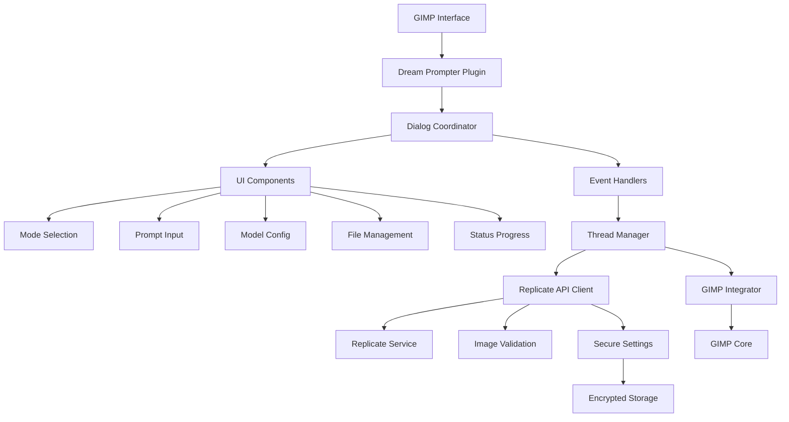

# System Architecture

## Overview

Dream Prompter is a GIMP plugin that integrates AI image generation and editing capabilities through the Replicate API. The architecture follows a modular design with clear separation of concerns, enabling maintainable and extensible AI-powered image manipulation within GIMP's native workflow.

## System Architecture

## Source Code Paths

### Core Components
- **`dream-prompter.py`** - Main GIMP plugin entry point and procedure registration
- **`dialog.py`** - Primary dialog coordinator managing UI lifecycle and settings
- **`api.py`** - Replicate API client with image processing and validation
- **`integrator.py`** - GIMP-specific operations for image/layer manipulation

### UI Layer
- **`dialog_gtk.py`** - GTK UI coordinator and component orchestration
- **`dialog_events.py`** - Event handling and user interaction logic
- **`dialog_threads.py`** - Background processing and threading management
- **`ui_*.py`** - Modular UI components:
  - `ui_mode_selection.py` - Operation mode selection
  - `ui_prompt_input.py` - Text prompt input interface
  - `ui_model_config.py` - Model selection and parameter configuration
  - `ui_file_management.py` - Reference image selection and display
  - `ui_status_progress.py` - Progress indicators and status updates

### Supporting Infrastructure
- **`settings.py`** - Configuration persistence with encryption
- **`constants.py`** - Application constants and limits
- **`i18n.py`** - Internationalization support
- **`stubs/`** - Type stubs for GTK/GIMP libraries

### Build and Localization
- **`scripts/`** - Build scripts for translations and development
- **`locale/`** - Translation files and compiled message catalogs

## Key Technical Decisions

### Modular UI Architecture
- **Decision**: Component-based UI with separate modules for each feature area
- **Rationale**: Enables independent development, testing, and maintenance of UI features
- **Impact**: Allows adding new models or features without touching core UI logic

### Threading Model
- **Decision**: Background threading for all AI operations with UI state synchronization
- **Rationale**: Prevents GIMP UI blocking during potentially long-running API calls
- **Impact**: Maintains responsive interface while processing large images or complex prompts

### Secure Settings Storage
- **Decision**: Encrypted API key storage using Fernet cryptography
- **Rationale**: Protects user credentials while maintaining usability
- **Impact**: Balances security with user experience (no repeated key entry)

### Image Validation Pipeline
- **Decision**: Multi-stage validation with size, format, and content checks
- **Rationale**: Prevents API failures and ensures compatibility with Replicate models
- **Impact**: Robust error handling and user feedback for invalid inputs

### GIMP Integration Strategy
- **Decision**: Native GIMP operations using Gio/GdkPixbuf for image handling
- **Rationale**: Ensures compatibility with GIMP's image processing pipeline
- **Impact**: Seamless layer creation and manipulation within GIMP's undo system

### GObject Signal-Based Decoupling
- **Decision**: GObject signals for event-driven communication between UI components
- **Rationale**: Reduces direct coupling and enables loose component interactions
- **Impact**: Improved maintainability and testability of UI components

### Interface-Based Communication
- **Decision**: Abstract interfaces for component interactions in `ui_interfaces.py`
- **Rationale**: Defines clear contracts for component communication
- **Impact**: Enables pluggable implementations and easier testing

### Threading Safety Improvements
- **Decision**: Enhanced thread safety with dialog destruction checks and proper cleanup
- **Rationale**: Prevents race conditions in background processing
- **Impact**: More reliable operation during long-running AI tasks

### Error Recovery Mechanisms
- **Decision**: Comprehensive error handling with resource cleanup and recovery paths
- **Rationale**: Ensures graceful failure handling and resource management
- **Impact**: Better user experience during error conditions

## Design Patterns in Use

### Coordinator Pattern
- **Implementation**: `DreamPrompterDialog` coordinates between UI components and business logic
- **Benefits**: Centralizes dialog lifecycle management and reduces coupling

### Factory Pattern
- **Implementation**: UI component creation through modular factory methods
- **Benefits**: Enables runtime configuration and testing of UI components

### Observer Pattern
- **Implementation**: Event-driven UI updates through signal connections
- **Benefits**: Decouples UI components from business logic changes

### Strategy Pattern
- **Implementation**: Pluggable model configurations in `ui_model_config.py`
- **Benefits**: Easy addition of new AI models without core changes

### Command Pattern
- **Implementation**: Threaded execution of generate/edit operations
- **Benefits**: Encapsulates operation logic for queuing and cancellation

## Component Relationships

### Dialog Layer
The dialog layer (`dialog.py`, `dialog_gtk.py`) acts as the main coordinator:
- Manages overall plugin lifecycle
- Orchestrates UI component creation
- Handles settings persistence
- Coordinates between user interactions and background processing

### UI Components
Modular UI components (`ui_*.py`) provide focused functionality:
- Each component handles one aspect of the interface
- Components communicate through the dialog coordinator
- Enables independent testing and modification

### Event System
Event handlers (`dialog_events.py`) bridge user actions to business logic:
- Connects GTK signals to application logic
- Manages UI state transitions
- Coordinates background thread execution

### Threading Layer
Background processing (`dialog_threads.py`) manages async operations:
- Provides thread-safe state management
- Handles progress reporting and cancellation
- Ensures UI responsiveness during API calls

### API Layer
Replicate integration (`api.py`) handles external service communication:
- Manages API authentication and requests
- Processes image data and responses
- Provides validation and error handling

### Integration Layer
GIMP operations (`integrator.py`) handle native image manipulation:
- Creates and modifies GIMP layers
- Manages image export/import
- Preserves GIMP's undo capabilities

## Critical Implementation Paths

### Plugin Initialization
1. `dream-prompter.py::do_create_procedure()` - Register plugin with GIMP
2. `dream-prompter.py::run_dream_prompter()` - Launch dialog on menu selection
3. `dialog.py::__init__()` - Initialize dialog and UI components
4. `dialog.py::_load_settings()` - Restore user preferences

### Generate Workflow
1. User selects "Generate" mode and enters prompt
2. `dialog_events.py::on_generate()` - Validate inputs and start processing
3. `dialog_threads.py::start_generate_thread()` - Launch background thread
4. `dialog_threads.py::_generate_image_worker()` - Execute API call
5. `api.py::generate_image()` - Send request to Replicate
6. `integrator.py::create_new_image()` - Create GIMP image from result

### Edit Workflow
1. User selects "Edit" mode with open image
2. `dialog_events.py::on_generate()` - Process current layer
3. `integrator.py::export_current_region_to_bytes()` - Extract image data
4. `api.py::edit_image()` - Send edit request to Replicate
5. `integrator.py::create_edit_layer()` - Add result as new layer

### Settings Management
1. `settings.py::load_settings()` - Decrypt and validate stored settings
2. `settings.py::store_settings()` - Encrypt and persist user preferences
3. Cross-platform config file location handling

### Image Validation Pipeline
1. `api.py::_validate_reference_image()` - Size and format checks
2. `api.py::_validate_image_file_streaming()` - Content validation
3. `api.py::_bytes_to_pixbuf()` - Convert to GIMP-compatible format

## Data Flow

### Input Processing
User inputs → UI components → Event handlers → Validation → Thread queue → API client

### Output Processing
API response → Image validation → GIMP integrator → Layer creation → UI updates

### Error Handling
API errors → Thread callbacks → UI error display → User notification

### State Management
Settings → Encrypted storage ↔ Runtime state → UI synchronization